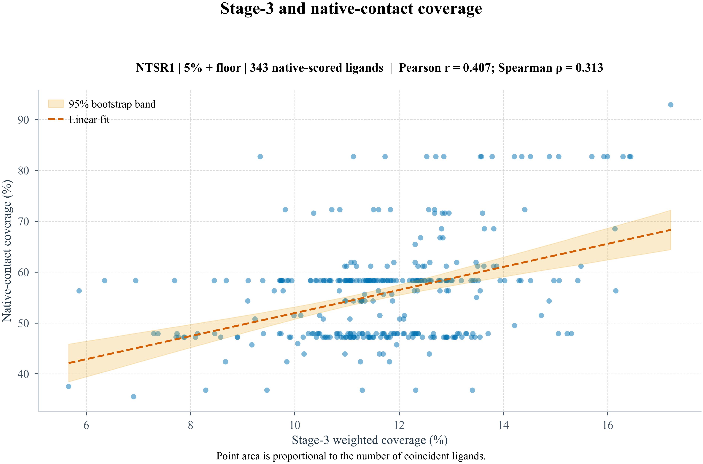
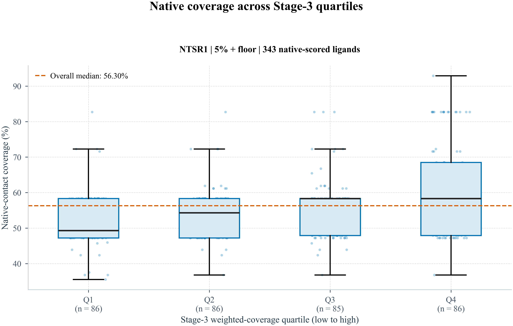
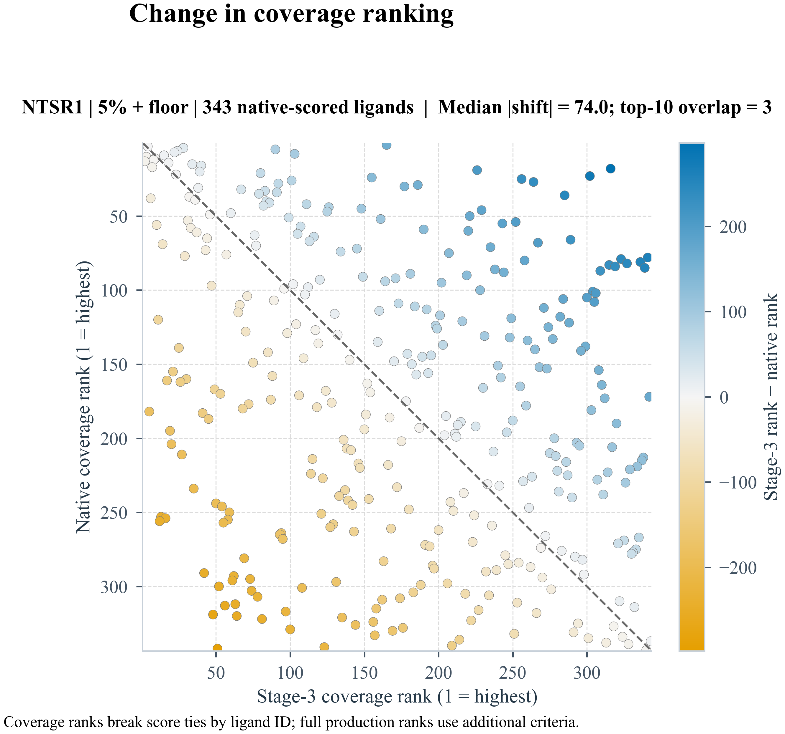
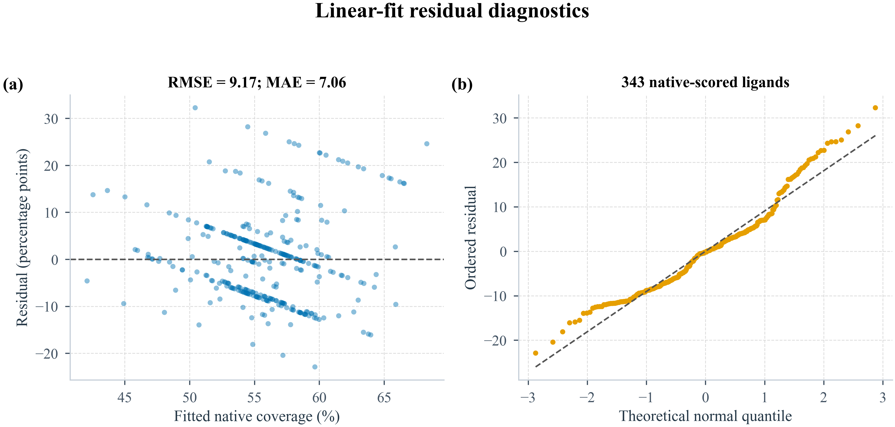

# NTSR1 | 5% + floor | 343 native-scored ligands Native Correlation Analysis

## Summary

- Pearson `r = 0.407` (95% bootstrap CI `0.298` to `0.505`)
- Spearman `rho = 0.313` (95% bootstrap CI `0.206` to `0.410`)
- Kendall `tau = 0.230` (95% bootstrap CI `0.152` to `0.304`)
- Linear slope: `2.27` native-coverage percentage points per 1 percentage point of screen weighted coverage
- Interpretation: The ligand-level comparison shows a moderate positive association between screening weighted coverage and native peptide-contact 3D mimicry.
- Highest native 3D coverage ligand: `CHEMBL3315213` (92.9% native coverage at 17.209% screen weighted coverage)
- Highest screen weighted coverage ligand: `CHEMBL3315213` (17.209% screen weighted coverage but 92.9% native coverage)
- Median absolute rank shift between the two scoring systems: `74.0` positions
- Top-10 overlap between screen ranking and native ranking: `3` ligands

## Quartile Summary

- `Q1 5.663-10.857%`: `n=86`; native median `49.3%`; native range `35.5%` to `82.7%`
- `Q2 10.864-11.675%`: `n=86`; native median `54.3%`; native range `36.8%` to `82.7%`
- `Q3 11.683-12.784%`: `n=85`; native median `58.3%`; native range `36.8%` to `82.7%`
- `Q4 12.784-17.209%`: `n=86`; native median `58.3%`; native range `36.8%` to `92.9%`

## Rank Reordering

- Strongest upward reranking under native 3D scoring: `ZINCk5000009Egfg` (screen rank `316` to native rank `18`)
- Strongest downward reranking under native 3D scoring: `ZINCk8000004iFHu` (screen rank `51` to native rank `342`)
- Interpretation: the native 3D score meaningfully reshuffles the screen-derived ordering, so screen `weighted_coverage_pct` and peptide-interface 3D mimicry should be treated as related but non-interchangeable prioritization signals.

## Residual Diagnostics

- Linear-fit RMSE: `9.17` native-coverage percentage points
- Linear-fit MAE: `7.06` native-coverage percentage points
- Residual standard deviation: `9.18`
- Spearman correlation between fitted values and absolute residuals: `0.189`
- Residual diagnostics are used here as a simple check on model adequacy; they do not upgrade the analysis from descriptive association to a causal or mechanistic model.

## Figures

See the [execution manifest](../manifests/analysis_manifest.json) for the native configuration, selection settings, and final sorting contract.

## Scope of the diagnostic ranks

These descriptive plots compare coverage-only rankings. They break equal coverage values by ligand ID and therefore differ from the full production sorting contract, which also uses fit geometry and other criteria. They do not establish active enrichment. The current retrospective enrichment statistics instead retain equal-status/equal-score ties and average early-retrieval metrics over within-tie orders.
