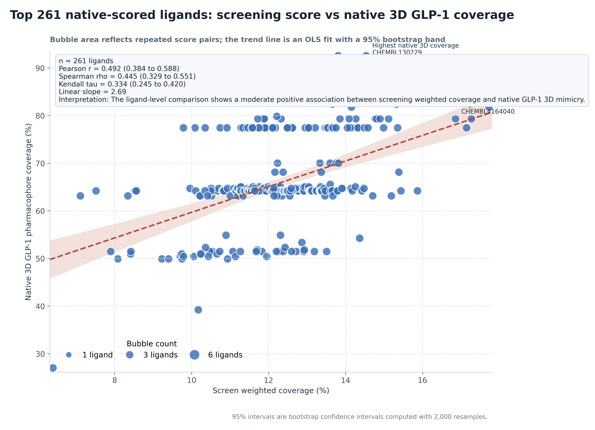
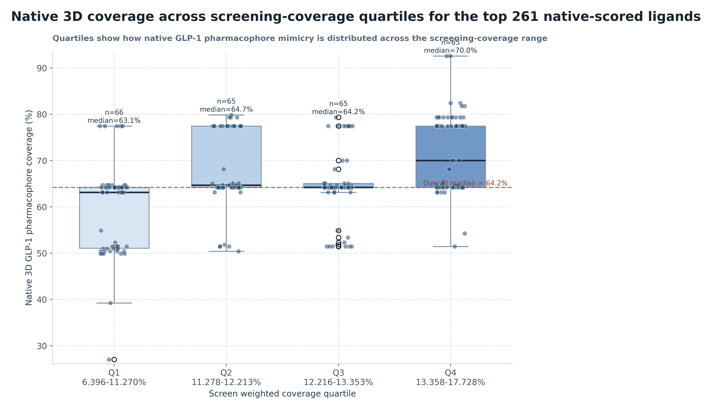
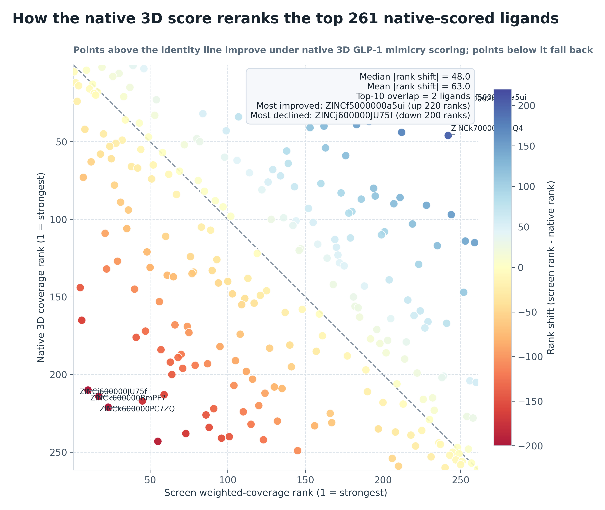
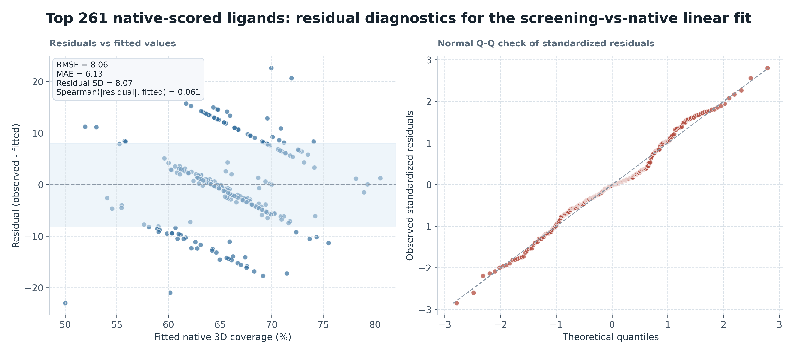

# Top 261 native-scored ligands Native Correlation Analysis

## Summary

- Pearson `r = 0.492` (95% bootstrap CI `0.384` to `0.588`)
- Spearman `rho = 0.445` (95% bootstrap CI `0.329` to `0.551`)
- Kendall `tau = 0.334` (95% bootstrap CI `0.245` to `0.420`)
- Linear slope: `2.69` native-coverage percentage points per 1 percentage point of screen weighted coverage
- Interpretation: The ligand-level comparison shows a moderate positive association between screening weighted coverage and native GLP-1 3D mimicry.
- Highest native 3D coverage ligand: `CHEMBL130229` (92.6% native coverage at 14.536% screen weighted coverage)
- Highest screen weighted coverage ligand: `CHEMBL4164040` (17.728% screen weighted coverage but 81.8% native coverage)
- Median absolute rank shift between the two scoring systems: `48.0` positions
- Top-10 overlap between screen ranking and native ranking: `2` ligands

## Quartile Summary

- `Q1 6.396-11.270%`: `n=66`; native median `63.1%`; native range `27.0%` to `77.4%`
- `Q2 11.278-12.213%`: `n=65`; native median `64.7%`; native range `50.4%` to `79.8%`
- `Q3 12.216-13.353%`: `n=65`; native median `64.2%`; native range `51.5%` to `79.3%`
- `Q4 13.358-17.728%`: `n=65`; native median `70.0%`; native range `51.5%` to `92.6%`

## Rank Reordering

- Strongest upward reranking under native 3D scoring: `ZINCf5000000a5ui` (screen rank `246` to native rank `26`)
- Strongest downward reranking under native 3D scoring: `ZINCj600000JU75f` (screen rank `10` to native rank `210`)
- Interpretation: the native 3D score meaningfully reshuffles the screen-derived ordering, so screen `weighted_coverage_pct` and peptide-interface 3D mimicry should be treated as related but non-interchangeable prioritization signals.

## Residual Diagnostics

- Linear-fit RMSE: `8.06` native-coverage percentage points
- Linear-fit MAE: `6.13` native-coverage percentage points
- Residual standard deviation: `8.07`
- Spearman correlation between fitted values and absolute residuals: `0.061`
- Residual diagnostics are used here as a simple check on model adequacy; they do not upgrade the analysis from descriptive association to a causal or mechanistic model.

## Figures

See also [methodology](methodology.md) for the exact native 3D scoring procedure.
