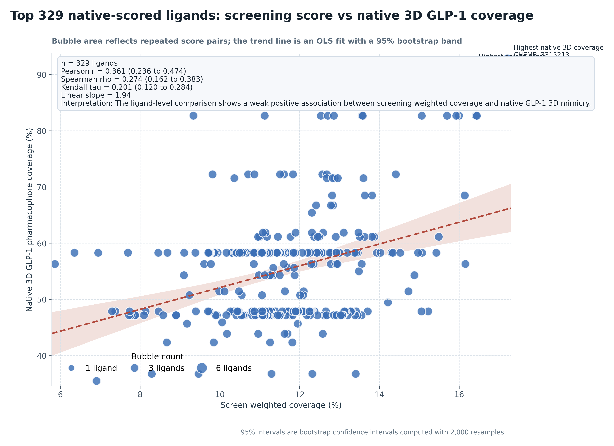
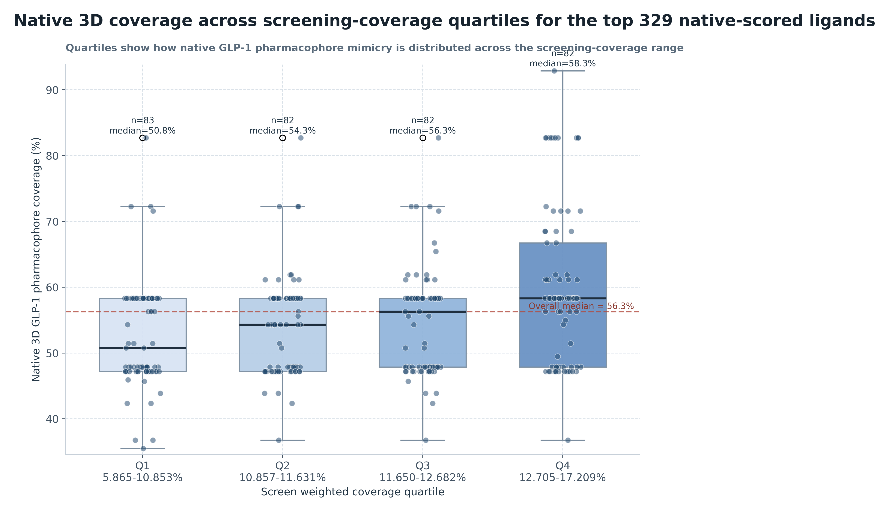
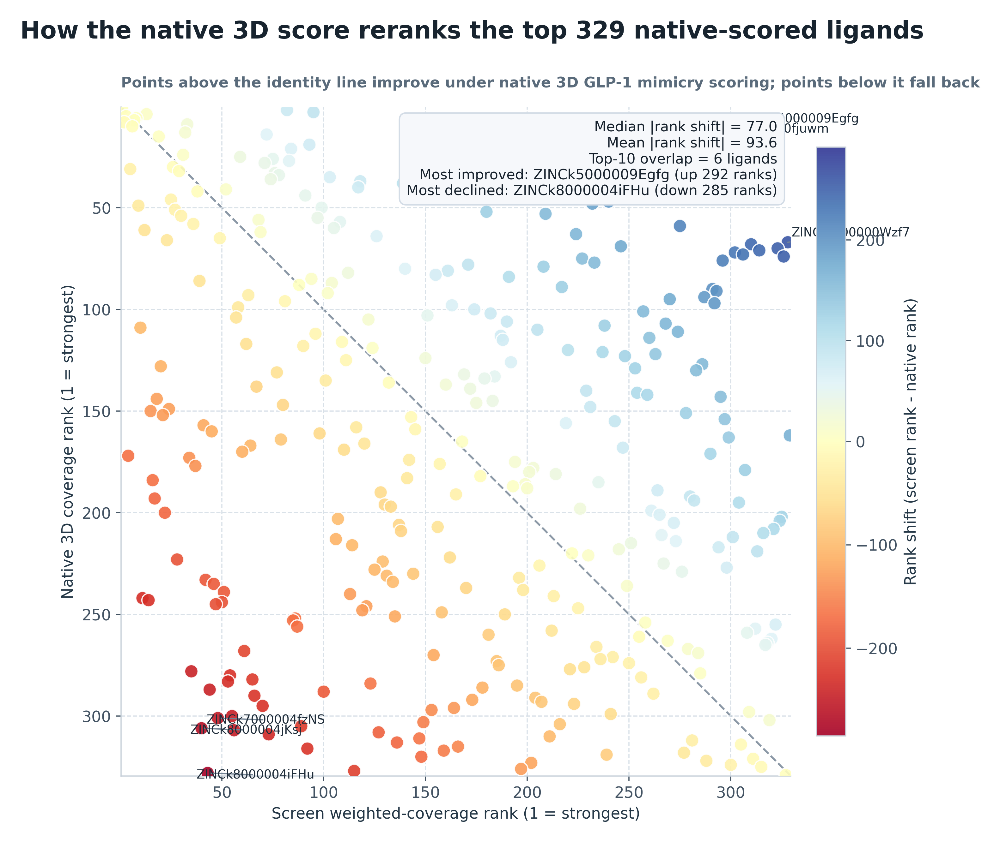
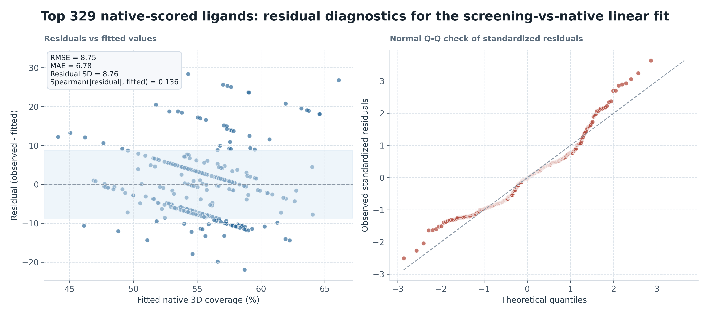

# Top 329 native-scored ligands Native Correlation Analysis

## Summary

- Pearson `r = 0.361` (95% bootstrap CI `0.236` to `0.474`)
- Spearman `rho = 0.274` (95% bootstrap CI `0.162` to `0.383`)
- Kendall `tau = 0.201` (95% bootstrap CI `0.120` to `0.284`)
- Linear slope: `1.94` native-coverage percentage points per 1 percentage point of screen weighted coverage
- Interpretation: The ligand-level comparison shows a weak positive association between screening weighted coverage and native GLP-1 3D mimicry.
- Highest native 3D coverage ligand: `CHEMBL3315213` (92.9% native coverage at 17.209% screen weighted coverage)
- Highest screen weighted coverage ligand: `CHEMBL3315213` (17.209% screen weighted coverage but 92.9% native coverage)
- Median absolute rank shift between the two scoring systems: `77.0` positions
- Top-10 overlap between screen ranking and native ranking: `6` ligands

## Quartile Summary

- `Q1 5.865-10.853%`: `n=83`; native median `50.8%`; native range `35.5%` to `82.7%`
- `Q2 10.857-11.631%`: `n=82`; native median `54.3%`; native range `36.8%` to `82.7%`
- `Q3 11.650-12.682%`: `n=82`; native median `56.3%`; native range `36.8%` to `82.7%`
- `Q4 12.705-17.209%`: `n=82`; native median `58.3%`; native range `36.8%` to `92.9%`

## Rank Reordering

- Strongest upward reranking under native 3D scoring: `ZINCk5000009Egfg` (screen rank `303` to native rank `11`)
- Strongest downward reranking under native 3D scoring: `ZINCk8000004iFHu` (screen rank `43` to native rank `328`)
- Interpretation: the native 3D score meaningfully reshuffles the screen-derived ordering, so screen `weighted_coverage_pct` and peptide-interface 3D mimicry should be treated as related but non-interchangeable prioritization signals.

## Residual Diagnostics

- Linear-fit RMSE: `8.75` native-coverage percentage points
- Linear-fit MAE: `6.78` native-coverage percentage points
- Residual standard deviation: `8.76`
- Spearman correlation between fitted values and absolute residuals: `0.136`
- Residual diagnostics are used here as a simple check on model adequacy; they do not upgrade the analysis from descriptive association to a causal or mechanistic model.

## Figures

See also [methodology](methodology.md) for the exact native 3D scoring procedure.
