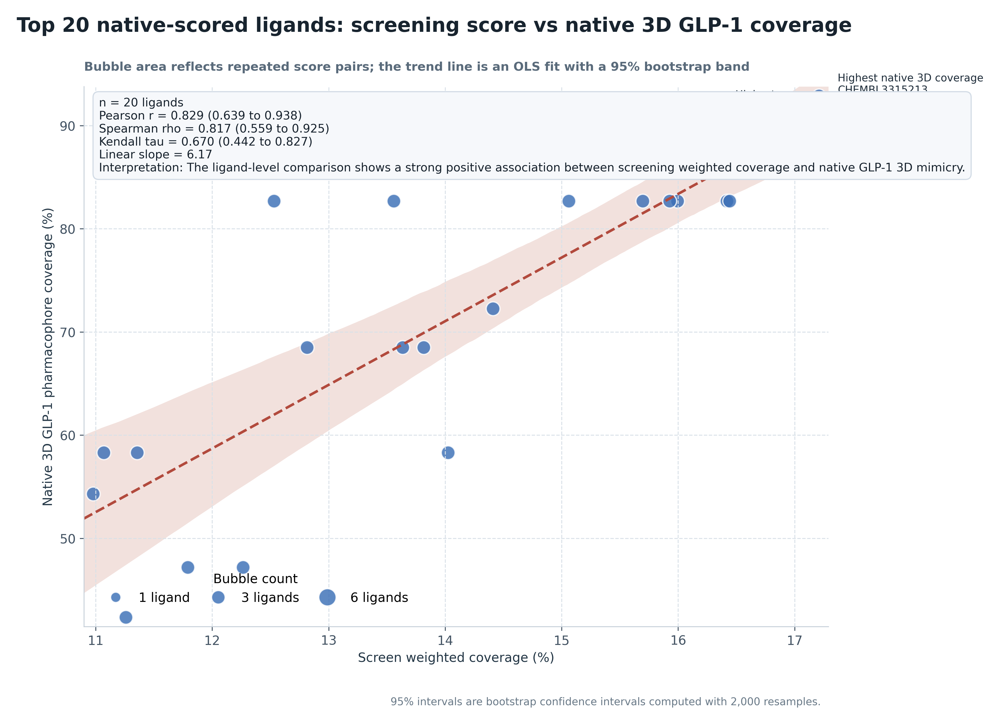
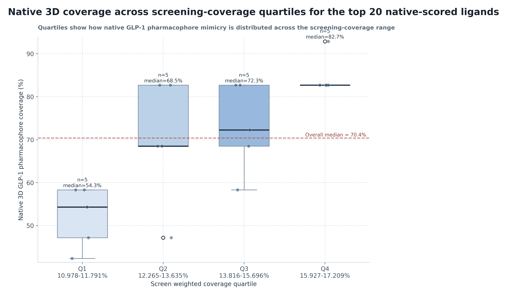
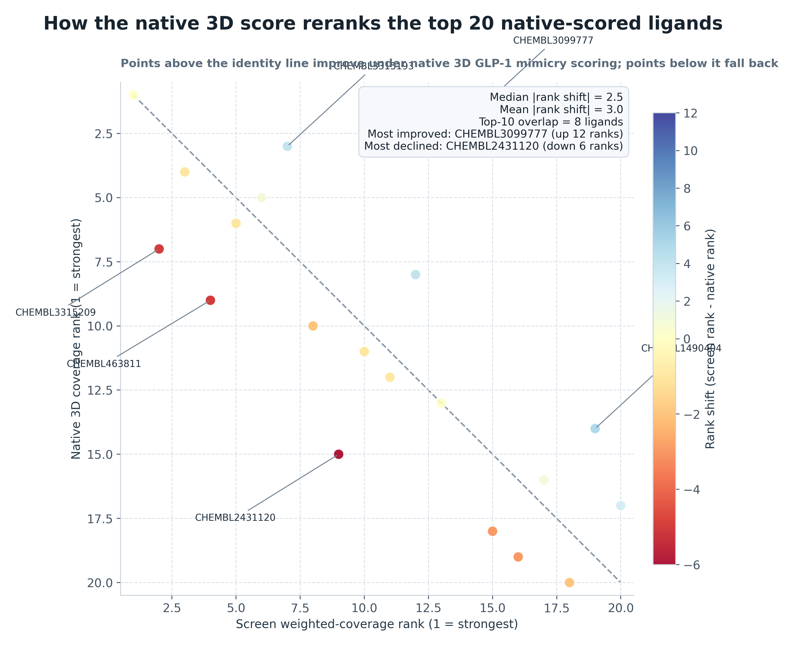
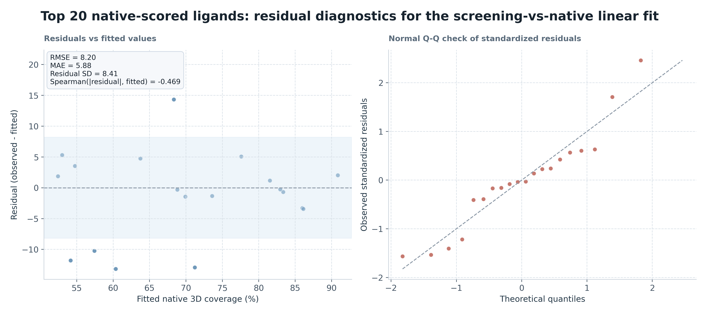

# Top 20 native-scored ligands Native Correlation Analysis

## Summary

- Pearson `r = 0.829` (95% bootstrap CI `0.639` to `0.938`)
- Spearman `rho = 0.817` (95% bootstrap CI `0.559` to `0.925`)
- Kendall `tau = 0.670` (95% bootstrap CI `0.442` to `0.827`)
- Linear slope: `6.17` native-coverage percentage points per 1 percentage point of screen weighted coverage
- Interpretation: The ligand-level comparison shows a strong positive association between screening weighted coverage and native GLP-1 3D mimicry.
- Highest native 3D coverage ligand: `CHEMBL3315213` (92.9% native coverage at 17.209% screen weighted coverage)
- Highest screen weighted coverage ligand: `CHEMBL3315213` (17.209% screen weighted coverage but 92.9% native coverage)
- Median absolute rank shift between the two scoring systems: `2.5` positions
- Top-10 overlap between screen ranking and native ranking: `8` ligands

## Quartile Summary

- `Q1 10.978-11.791%`: `n=5`; native median `54.3%`; native range `42.4%` to `58.3%`
- `Q2 12.265-13.635%`: `n=5`; native median `68.5%`; native range `47.2%` to `82.7%`
- `Q3 13.816-15.696%`: `n=5`; native median `72.3%`; native range `58.3%` to `82.7%`
- `Q4 15.927-17.209%`: `n=5`; native median `82.7%`; native range `82.7%` to `92.9%`

## Rank Reordering

- Strongest upward reranking under native 3D scoring: `CHEMBL3099777` (screen rank `14` to native rank `2`)
- Strongest downward reranking under native 3D scoring: `CHEMBL2431120` (screen rank `9` to native rank `15`)
- Interpretation: the native 3D score meaningfully reshuffles the screen-derived ordering, so screen `weighted_coverage_pct` and peptide-interface 3D mimicry should be treated as related but non-interchangeable prioritization signals.

## Residual Diagnostics

- Linear-fit RMSE: `8.20` native-coverage percentage points
- Linear-fit MAE: `5.88` native-coverage percentage points
- Residual standard deviation: `8.41`
- Spearman correlation between fitted values and absolute residuals: `-0.469`
- Residual diagnostics are used here as a simple check on model adequacy; they do not upgrade the analysis from descriptive association to a causal or mechanistic model.

## Figures

See also [methodology](methodology.md) for the exact native 3D scoring procedure.
