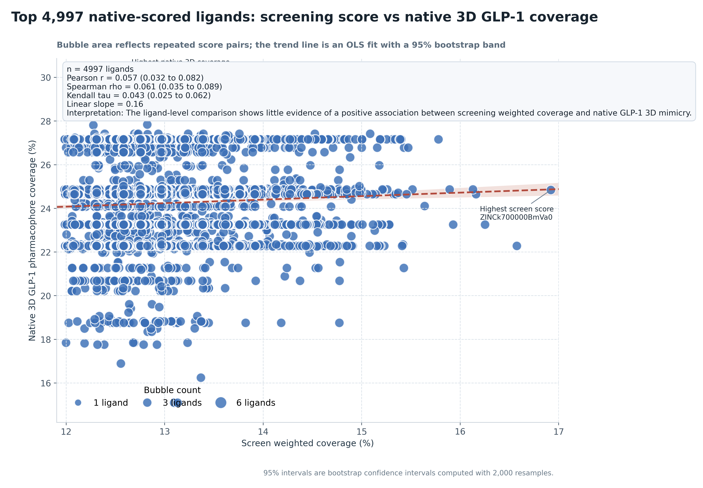
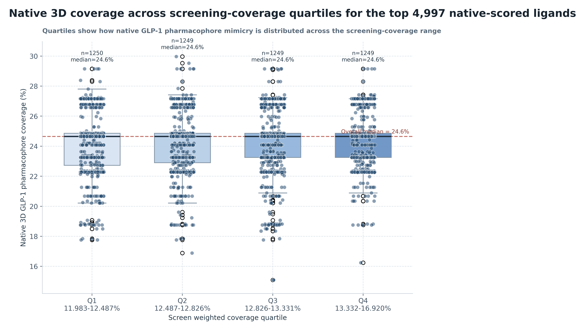
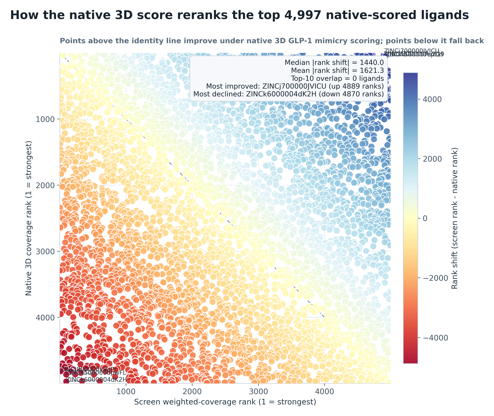
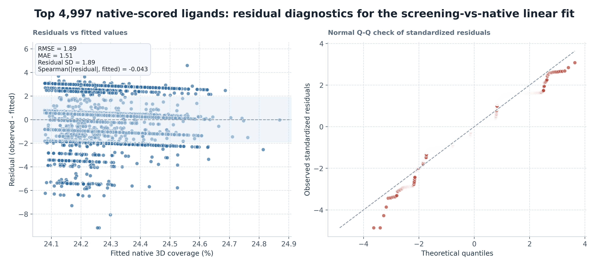

# Top 4,997 native-scored ligands Native Correlation Analysis

## Summary

- Pearson `r = 0.057` (95% bootstrap CI `0.032` to `0.082`)
- Spearman `rho = 0.061` (95% bootstrap CI `0.035` to `0.089`)
- Kendall `tau = 0.043` (95% bootstrap CI `0.025` to `0.062`)
- Linear slope: `0.16` native-coverage percentage points per 1 percentage point of screen weighted coverage
- Interpretation: The ligand-level comparison shows little evidence of a positive association between screening weighted coverage and native GLP-1 3D mimicry.
- Highest native 3D coverage ligand: `ZINCk700001bQgxo` (30.0% native coverage at 12.504% screen weighted coverage)
- Highest screen weighted coverage ligand: `ZINCk700000BmVa0` (16.920% screen weighted coverage but 24.8% native coverage)
- Median absolute rank shift between the two scoring systems: `1440.0` positions
- Top-10 overlap between screen ranking and native ranking: `0` ligands

## Quartile Summary

- `Q1 11.983-12.487%`: `n=1250`; native median `24.6%`; native range `17.8%` to `29.1%`
- `Q2 12.487-12.826%`: `n=1249`; native median `24.6%`; native range `16.9%` to `30.0%`
- `Q3 12.826-13.331%`: `n=1249`; native median `24.6%`; native range `15.1%` to `29.1%`
- `Q4 13.332-16.920%`: `n=1249`; native median `24.6%`; native range `16.2%` to `29.1%`

## Rank Reordering

- Strongest upward reranking under native 3D scoring: `ZINCj700000JVICU` (screen rank `4895` to native rank `6`)
- Strongest downward reranking under native 3D scoring: `ZINCk6000004dK2H` (screen rank `98` to native rank `4968`)
- Interpretation: the native 3D score meaningfully reshuffles the screen-derived ordering, so screen `weighted_coverage_pct` and peptide-interface 3D mimicry should be treated as related but non-interchangeable prioritization signals.

## Residual Diagnostics

- Linear-fit RMSE: `1.89` native-coverage percentage points
- Linear-fit MAE: `1.51` native-coverage percentage points
- Residual standard deviation: `1.89`
- Spearman correlation between fitted values and absolute residuals: `-0.043`
- Residual diagnostics are used here as a simple check on model adequacy; they do not upgrade the analysis from descriptive association to a causal or mechanistic model.

## Figures

See also [methodology](methodology.md) for the exact native 3D scoring procedure.
